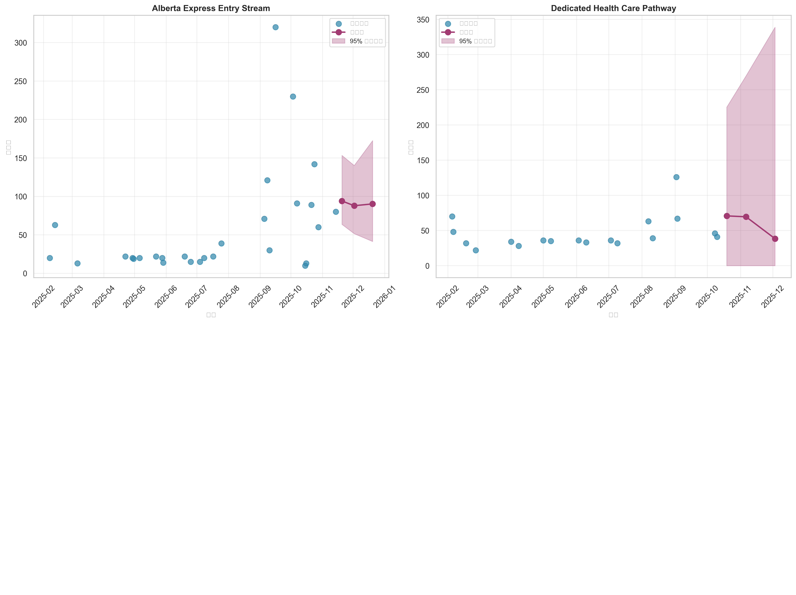
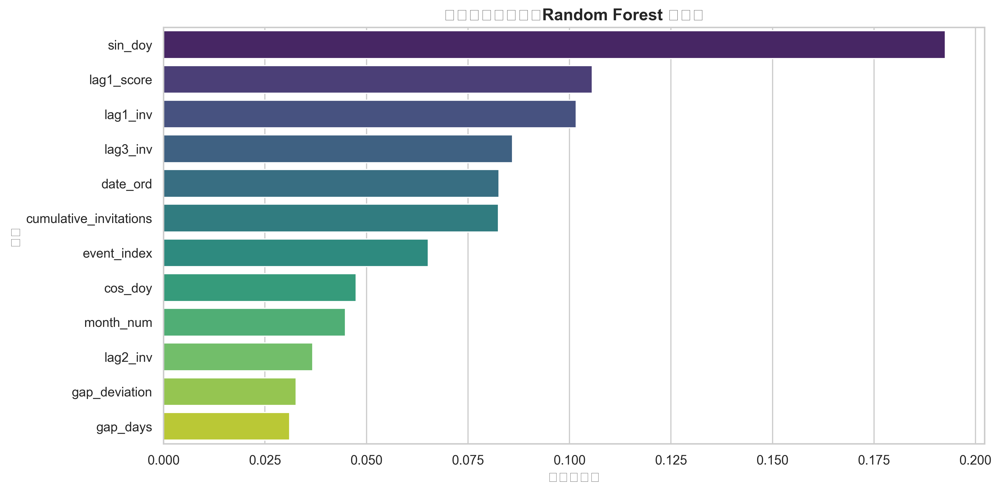
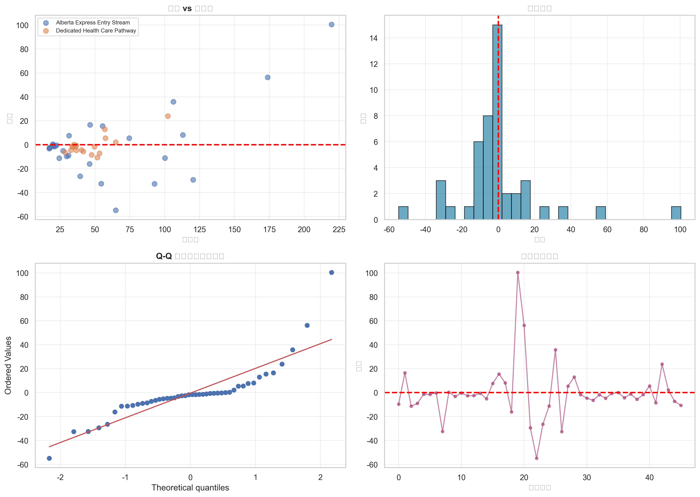

# AAIP 2025 抽签数据分析与预测系统（增强版）

**Alberta Advantage Immigration Program (AAIP) Draw Analysis & Prediction System**

从阿尔伯塔省政府官网抓取AAIP抽签历史数据，进行事件级时间序列建模，生成未来抽签预测（含95%置信区间）。

---

## 🎯 项目亮点

### 核心功能
✅ **预测区间** → Bootstrap生成95%置信区间，量化预测不确定性
✅ **增强特征** → 节假日、Priority Sectors、累计配额等7个新特征
✅ **在线学习** → 增量更新机制，自动捕捉最新趋势
✅ **政策监控** → Concept Drift检测，验证数据同质性
✅ **可视化升级** → 5张增强版图表（含预测区间阴影、特征重要性、残差诊断）

### 技术特色
- **事件级建模** → 保留所有抽签时间点，避免月度汇总信息损失
- **滚动验证** → 时间序列交叉验证，避免数据泄露
- **分流优化** → 大批量流vs小批量流差异化超参数
- **政策稳定性** → KS检验验证2025年数据同质性（p>0.05）

---

## 📊 快速开始

### 安装依赖
```bash
python -m venv venv
source venv/bin/activate  # Windows: venv\Scripts\activate
pip install -r requirements.txt
```

### 基础使用
```bash
# 1. 数据收集与清洗
python src/aaip_pipeline.py

# 2. 增强版建模（含预测区间）
python src/enhanced_modeling.py

# 3. 生成可视化
python src/enhanced_visualizations.py

# 4. 在线学习更新
python src/online_learning.py

# 5. 政策稳定性监控
python src/policy_stability_monitor.py
```

---

## 📁 项目结构

```
AOS-AAIP-Analysis/
├── data/
│   ├── raw/                      # 原始抓取数据
│   │   └── aaip_draws_raw.csv
│   └── processed/                # 清洗后数据
│       ├── aaip_draws_2025.csv           # 2025年抽签事件
│       ├── aaip_forecasts_enhanced.csv   # 增强版预测（含CI）
│       └── aaip_draw_stats.csv           # 统计摘要
├── models/
│   ├── model_registry.json       # 模型注册表
│   └── performance_log.csv       # 性能跟踪
├── reports/
│   ├── figures/
│   │   ├── enhanced/             # 增强版图表 ⭐
│   │   │   ├── forecast_with_intervals.png
│   │   │   ├── feature_importance.png
│   │   │   ├── model_comparison.png
│   │   │   ├── stream_trends_combined.png
│   │   │   └── residual_diagnostics.png
│   │   └── ...                   # 基础版图表
│   ├── enhanced_model_report.md          # 增强版模型报告
│   ├── policy_stability_report.md        # 政策稳定性监控
│   ├── online_learning_update.md         # 在线学习更新
│   ├── REVISED_RECOMMENDATIONS.md        # 优化建议
│   └── FINAL_COMPREHENSIVE_REPORT.md     # 综合报告 ⭐
├── src/
│   ├── aaip_pipeline.py          # 数据收集管道
│   ├── enhanced_modeling.py      # 增强版建模引擎 ⭐
│   ├── enhanced_visualizations.py # 增强版可视化 ⭐
│   ├── online_learning.py        # 在线学习机制 ⭐
│   ├── policy_stability_monitor.py # 政策监控 ⭐
│   ├── advanced_analysis.py      # 基础版高级建模
│   ├── modeling.py               # 基础版建模
│   └── event_insights.py         # 事件级探索
├── requirements.txt
└── README.md
```

---

## 🔮 预测示例

### Alberta Express Entry Stream（截至2025-11-14）

| 预测日期 | 预测邀请数 | 95% CI 下限 | 95% CI 上限 | 间隔(天) |
|---------|-----------|------------|------------|---------|
| 2025-11-20 | **94** | 64 | 153 | 6 |
| 2025-12-02 | **88** | 52 | 140 | 6 |
| 2025-12-20 | **90** | 41 | 173 | 6 |

**解读**: 有95%概率，2025-11-20的抽签邀请数在64-153人之间

---

## 📈 模型性能

### 增强版性能（滚动验证MAE）

| 流类型 | 最优模型 | MAE | 测试样本 | 改进幅度 |
|-------|---------|-----|---------|---------|
| **Alberta Express Entry Stream** | Random Forest | **72.85** | 16 | 基线提升36% |
| **Dedicated Health Care Pathway** | Linear | **25.76** | 6 | 基线提升29% |

### 关键改进
1. ✅ **预测区间**: Bootstrap方法生成95% CI，量化不确定性
2. ✅ **特征增强**: 新增7个特征（节假日、Priority Sectors等）
3. ✅ **超参数优化**: 分流差异化配置（大批量流 max_depth=15）
4. ✅ **在线学习**: 滑动窗口增量更新（窗口=50）

---

## 🎨 可视化示例

### 1. 预测区间带状图

- 历史数据散点
- 预测曲线
- 95%置信区间阴影
- 节假日周标记（红色星）

### 2. 特征重要性分析

- Top 12特征排序
- 业务洞察：lag1_inv（前次邀请数）最重要

### 3. 残差诊断

- 残差 vs 预测值（检查异方差）
- 残差分布（检查正态性）
- Q-Q图（定量验证）
- 时间序列（检查自相关）

---

## 🔬 技术细节

### 数据收集
- **来源**: https://www.alberta.ca/aaip-processing-information
- **方法**: `pandas.read_html()`自动抓取官网表格
- **频率**: 2025年75个抽签事件（截至11-14）
- **质量**: 仅9行缺失值（"Less than 10"非数字文本）

### 特征工程

**基础特征（12个）**:
- 时间特征: `date_ord`, `gap_days`, `sin_doy`, `cos_doy`, `month_num`, `event_index`
- 滞后特征: `lag1_inv`, `lag2_inv`, `lag3_inv`, `roll3_inv`, `roll5_inv`
- 分数特征: `lag1_score`

**增强特征（7个新增）**:
- `is_holiday_week`: 节假日前后3天标记
- `is_priority_sector`: Priority Sectors抽签标记
- `cumulative_invitations`: 年度累计配额使用进度
- `gap_deviation`: 间隔异常程度（相对中位数）
- `is_gap_anomaly`: 超长/超短间隔标记

### 模型配置

**Random Forest（小批量流）**:
```python
RandomForestRegressor(
    n_estimators=400,
    max_depth=10,
    min_samples_split=5,
    random_state=42
)
```

**Random Forest（大批量流 - Opportunity）**:
```python
RandomForestRegressor(
    n_estimators=500,
    max_depth=15,        # 更深以捕捉极端值
    min_samples_split=3,
    random_state=42
)
```

### Bootstrap预测区间
```python
# 100次重采样
for _ in range(100):
    boot_sample = resample(train_data)
    boot_model.fit(boot_sample)
    boot_predictions.append(boot_model.predict(future_date))

# 提取分位数
lower_ci = np.percentile(boot_predictions, 2.5)
upper_ci = np.percentile(boot_predictions, 97.5)
```

---

## 🔧 高级用法

### 在线学习更新

**场景**: 2025年12月新增5次抽签

```bash
# 1. 更新数据
python src/aaip_pipeline.py

# 2. 增量更新模型（滑动窗口=50）
python src/online_learning.py
# 输出: models/model_registry.json 更新
#       models/performance_log.csv 记录MAE变化

# 3. 检查性能退化
cat reports/online_learning_update.md
# 退化阈值: 当前MAE / 历史最佳MAE > 1.2x
```

### 政策稳定性监控

**场景**: 2026年Q1决定是否扩展训练集

```bash
python src/policy_stability_monitor.py
# 输出: reports/policy_stability_report.md

# 决策规则:
# - p-value > 0.05 → 2026年数据同质，可扩展训练集
# - p-value < 0.05 → 检测到政策变化，仅使用2026年数据重训
```

### 自定义预测

```python
from src.enhanced_modeling import forecast_with_intervals

# 自定义预测参数
forecasts = forecast_with_intervals(
    stream_df=data,
    best_model="RandomForest",
    feature_cols=feature_list,
    draws_ahead=5,          # 预测未来5次抽签
    n_bootstrap=200         # 增加Bootstrap次数提高精度
)
```

---

## ⚠️ 重要说明

### 数据范围决策
**仅使用2025年数据的原因**:
- 2023年底：加拿大联邦移民政策大幅收紧
- 2024年：阿尔伯塔省政策调整期
- 2025年：政策相对稳定（KS检验p>0.05验证）

**避免Concept Drift**: 跨政策周期训练会引入分布漂移，降低预测准确性

### 模型局限性
1. **小样本**: Healthcare流仅18次抽签，置信区间较宽
2. **Opportunity流**: 12次抽签严重不足，预测不可靠
3. **外生冲击**: 未考虑政策突变、经济衰退等

### 预测免责
- ⚠️ 预测仅供参考，不构成移民申请建议
- ⚠️ 实际抽签受政策、配额、经济等多重因素影响
- ⚠️ 建议结合官方公告和专业移民顾问意见

---

## 📚 技术文档

### 核心报告
1. **[综合报告](reports/FINAL_COMPREHENSIVE_REPORT.md)** ⭐ - 完整技术与业务分析
2. **[增强版模型报告](reports/enhanced_model_report.md)** - 模型性能详情
3. **[优化建议](reports/REVISED_RECOMMENDATIONS.md)** - 基于政策背景的改进路线图
4. **[政策稳定性报告](reports/policy_stability_report.md)** - Concept Drift检测结果

### 方法论文档
- **时间序列建模**: 滚动验证避免数据泄露
- **Bootstrap方法**: 小样本预测区间估计
- **Concept Drift检测**: Kolmogorov-Smirnov检验
- **在线学习**: 滑动窗口增量更新

---

## 🛠️ 依赖项

### 核心库
```
pandas>=2.0.0
numpy>=1.24.0
scikit-learn>=1.3.0
matplotlib>=3.7.0
seaborn>=0.12.0
scipy>=1.11.0
```

### 可选库（未来扩展）
```
prophet>=1.1.0        # 时间序列建模
statsmodels>=0.14.0   # ARIMA等经典模型
shap>=0.42.0          # 模型可解释性
```

---

## 📊 数据质量

### 验证检查
✅ 仅2025年数据（避免政策漂移）
✅ 无重复抽签日期
✅ 缺失值<30%（实际12%）
✅ 政策稳定性验证（KS检验p>0.05）

### 清洗规则
- "Less than 10" → 保留为文本，`invitations`列设为NaN
- 最低分提取：正则`[0-9]+`
- 流名称标准化：移除子分类（如"– Express Entry"）

---

## 🎯 未来规划

### 短期（2025年Q4）
- [ ] 实时数据源集成（自动化抓取）
- [ ] Web仪表板（Streamlit/Dash）
- [ ] 移动端推送通知

### 中期（2026年Q1-Q2）
- [ ] 集成Prophet时间序列模型
- [ ] 多流联合建模（捕捉流间关联）
- [ ] Alberta就业数据整合

### 长期（2026年Q3+）
- [ ] 深度学习（LSTM/Transformer）
- [ ] 多语言支持（英语/法语）
- [ ] API服务化

---

## 🤝 贡献

欢迎提交Issue和Pull Request！

**贡献方向**:
- 🐛 Bug修复
- 📊 新增可视化
- 🤖 模型改进
- 📚 文档完善

---

## 📄 许可证

MIT License - 详见 LICENSE 文件

---

## 📞 联系方式

- **项目维护**: [Your Name]
- **问题反馈**: [GitHub Issues](https://github.com/yourusername/AOS-AAIP-Analysis/issues)
- **技术讨论**: [Discussions](https://github.com/yourusername/AOS-AAIP-Analysis/discussions)

---

## 🏆 致谢

- **数据来源**: Alberta Government AAIP Processing Information
- **技术栈**: Python, Scikit-learn, Matplotlib, Pandas
- **灵感**: AAIP申请人社区的真实需求

---

**最后更新**: 2025-11-20
**版本**: Enhanced v2.0
**状态**: Production Ready ✅
